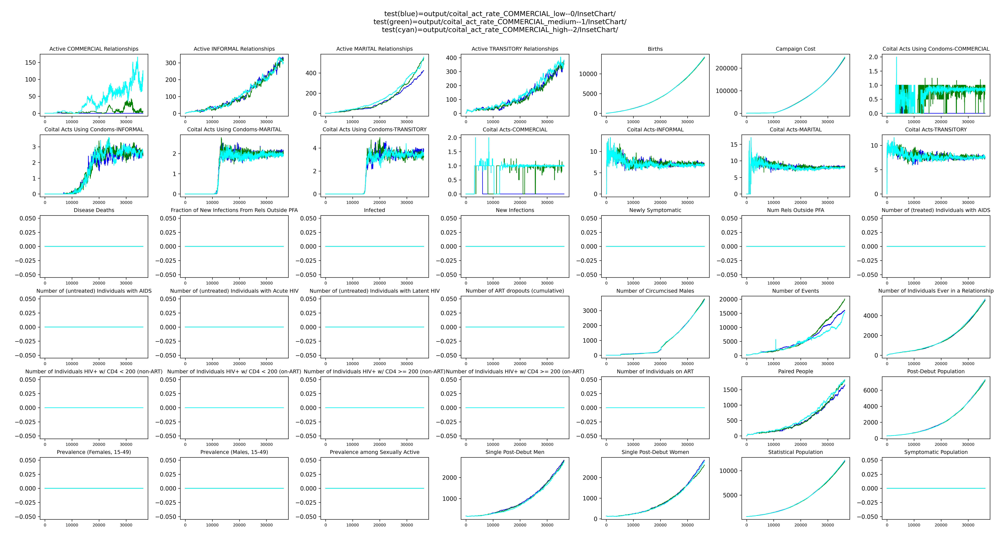

# Learn how to create scenarios and do sweeps

- a. Explain to sweep a parameter the parameter must be first be “available”.  Tell the user to do the “Using ParameterizedCalls” tutorial first.
- b. Use the available_parameters command to see the list of parameters that can be swept
- c. Explain that in the run command that one of the arguments is a sweeps file.
- d. Tell the user to read the reference on the sweep file.
- e. Download and open the sweep_formation_rate.py file
- i. The file should have different experiments for different rates, but each experiment should sweep a handful of Run_Numbers
- f. Tell the user to read the comments in the file
- g. Run the sweep
- h. Use the download command to download the InsetChart of each experiment
- i. Use plot_inset_chart_mean_compare to plot all three experiments


## **What is a scenario or sweep?**

A scenario (sweep) is a set of hyperparameters and values that will be applied to a frame. One can think of them as 
"what if" scenarios/simulations.

Hyperparameter values in a scenario are _arbitrary_. Every scenario has its own unique set of hyperparameters and values
that may or may not have any relation to other scenarios, depending on how a user wants to use them.

The hyperparameter values in a scenario are always applied _last_ to ensure they have final say in configuration.

In emodpy-workflow, scenarios are defined in a Python file with a specific format. This gives the user maximum 
flexibility in defining their scenarios while ensuring they can be understood by the **run** command. These files are
often called "sweep files".

## **Making scenarios**

The following is an exact requirement for the starting point of a sweep file to be used with a frame of choice with one 
blank scenario (with comments noting details of usage):

```python
frame_name = FILL_IN_NAME_OF_FRAME_TO_USE
# A sweep python file must contain a 'parameter_sets' attribute, which is a dict with keys being names of
# frames and values being dicts of param_name:value entries OR a generator of such dicts
parameter_sets = {
    # This key indicates the contained information is for building off the specified frame
    frame_name: {
        # Each dict in 'sweeps' list is a set of param: value overrides to be applied. A scenario.
        # Note that the parameter lists are arbitrary. Each scenario can include as many or few parameters
        # as you wish.
        # One experiment will be created per entry in 'sweeps'
        'sweeps': [
            # Optional: A provided 'experiment_name' in a sweep entry will name the corresponding experiment. Default
            #  experiment name is the name of the frame.
            {}  # This is an entirely blank scenario entry
        ]
    }
}
```

To modify the above for practical use requires:

- filling in the name of the frame to use
- filling in one or more sets of hyperparameters to modify

The following is a basic creates four scenarios on top of the **baseline** frame, the fourth of which makes no changes. 

**Copy/paste** it into a file named **sweeps.py** in your project directory.

```python
frame_name = 'baseline'
parameter_sets = {
    frame_name: {
        'sweeps': [
            {'experiment_name': 'coital_act_rate_COMMERCIAL_low',    'coital_act_rate--COMMERCIAL': 0.001},
            {'experiment_name': 'coital_act_rate_COMMERCIAL_medium', 'coital_act_rate--COMMERCIAL': 0.005},
            {'experiment_name': 'coital_act_rate_COMMERCIAL_high',   'coital_act_rate--COMMERCIAL': 0.01},
            {'experiment_name': 'coital_act_rate_COMMERCIAL_standard'},
        ]
    }
}
```

## **Using scenarios**

Sweep files are inputs to the **run** command. They are optional. Not specifying one is equivalent to running a frame
as-is (no changes).

When specified as an input to **run**, one experiment is created per 'sweeps' entry, each containing one simulation per
(calibrated) parameterization in the sample file (if provided). Otherwise, one simulation is contained per experiment.

The following command utilizes the above sweeps file that varies hyperparameter coital_act_rate--COMMERCIAL (with no 
samples).

Since there are four sweep entries, the command will generate:
one suite of four experiments of one simulation1, or 1 * 4 * 1 = 4 simulations in total.

```bash
python -m emodpy_workflow.scripts.run -F baseline -N commercial_sex_scenarios -o output -p ContainerPlatform -S sweeps.py
```

## **Downloading scenario output file(s)**

Output file(s) from completed simulation(s) can be obtained via the **download** command. The following will download
the InsetChart.json file from each simulation in each experiment in teh prior **run** execution:

```bash
python -m emodpy_workflow.scripts.download -f output/InsetChart.json -r output/experiment_index.csv -p ContainerPlatform
```

## **Plotting results**

The built-in **plot_inset_chart_mean_compare** command is able to plot several experiments of InsetChart.json data for
intercomparison. The following will plot data from the files just downloaded, one colored line per experiment (its 
average of one simulation each):

```bash
python -m emodpy_hiv.plotting.plot_inset_chart_mean_compare output/coital_act_rate_COMMERCIAL_low--0/InsetChart/ output/coital_act_rate_COMMERCIAL_medium--1/InsetChart/ output/coital_act_rate_COMMERCIAL_high--2/InsetChart/ -o plots
```

A generated .png file will be located at: **plots\InsetChart_Compare.png** for inspection. E.g.


